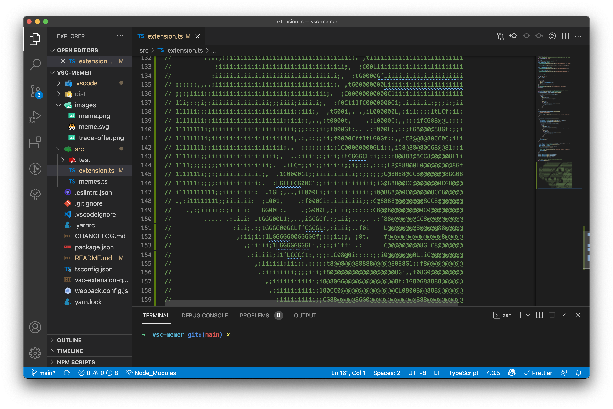

# Vscode comment meme maker

## Features

Memeing inside your code comments

usage:

Pressing Ctrl+Shift+P or Cmd+Shift+P on Mac and searching for 'meme'

- ascii charters based meme templates, can be directly insert into your code as comments
- supports any language with any comment style
- 30+ meme templates to choose from
- `shift+alt+m` to insert a random meme

## Requirements

You need to know how to make dank memes

## Extension Settings

| Name                | Default Value | Explanation                                                                    |
| ------------------- | ------------- | ------------------------------------------------------------------------------ |
| contextMenu.enabled | True          | Whether to show the Insert a random meme in the editor context menu            |
| commentStyle        | line          | Type of comment style, can be either line or block                             |
| lineComment         | //            | Symbol of line comments the generated meme should be wrapped in                |
| blockCommentLeft    | /\*           | Symbol of left side of block comments the generated meme should be wrapped in  |
| blockCommentRight   | \*/           | Symbol of right side of block comments the generated meme should be wrapped in |

## Supported Memes

| No  | description                      |
| --- | -------------------------------- |
| 1   | Distracted Boyfriend             |
| 2   | Drake Hotline Bling              |
| 3   | Two Buttons                      |
| 4   | Change My Mind                   |
| 5   | Anakin Padme 4 Panel             |
| 6   | UNO Draw 25 Cards                |
| 7   | Bernie Sanders Once Again Asking |
| 8   | Expanding Brain                  |
| 9   | Woman Yelling At Cat             |
| 10  | Monkey Puppet                    |
| 11  | Disaster Girl                    |
| 12  | Is This A Pigeon                 |
| 13  | Clown Applying Makeup            |
| 14  | Hide the Pain Harold             |
| 15  | American Chopper Argument        |
| 16  | They're The Same Picture         |
| 17  | Bike Fall                        |
| 18  | Surprised Pikachu                |
| 19  | Doge                             |
| 20  | You Guys are Getting Paid        |
| 21  | Unsettled Tom                    |
| 22  | Panik Kalm Panik                 |
| 23  | Leonardo Dicaprio Cheers         |
| 24  | Grant Gustin over grave          |
| 25  | Whisper and Goosebumps           |
| 26  | Three-headed Dragon              |
| 27  | Stonks                           |
| 28  | Disappointed Black Guy           |
| 29  | Boardroom Meeting Suggestion     |
| 30  | Write That Down                  |

## Roadmap

Below are the features I'd like to implement if this gains popularity

- [ ] Allows user to add their own templates
- [ ] Comment config per language
- [ ] Auto generate meme from url

## Release Notes

### 0.0.3

- updated memes to be much clearer
- updated readme

### 0.0.1

Initial release

## Thanks

Icons made by <a href="https://www.freepik.com" title="Freepik">Freepik</a> from <a href="https://www.flaticon.com/" title="Flaticon">www.flaticon.com</a>

